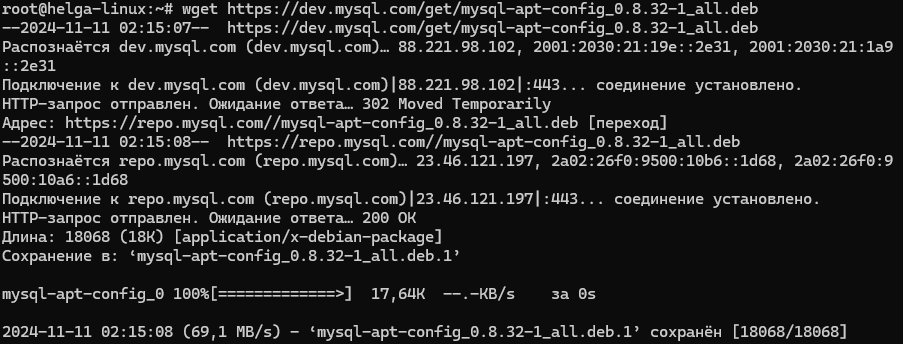
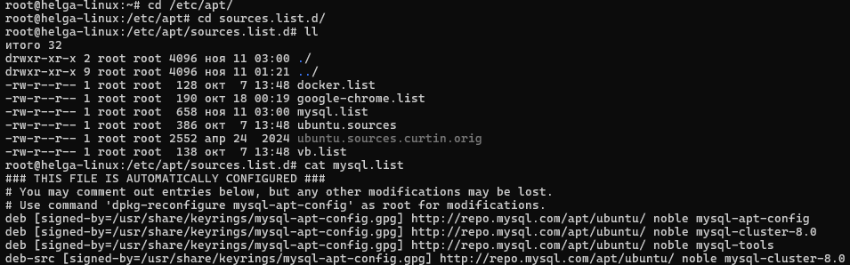
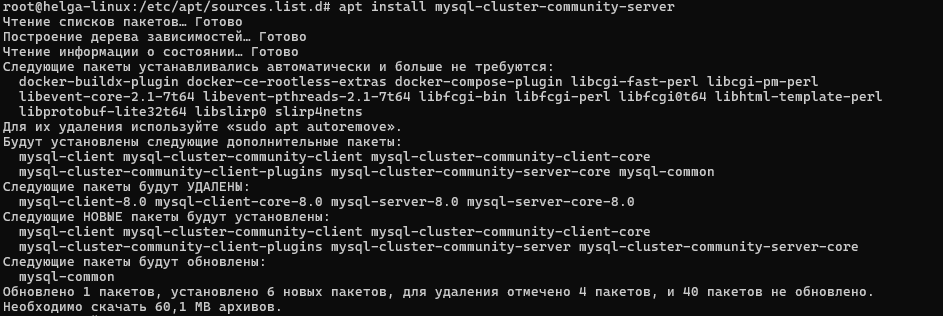

### Операционные системы и виртуализация (Linux)

1. **Использование команды `cat` в Linux**

- Создать два текстовых файла: "Pets" (Домашние животные) и "Pack animals" (Вьючные животные), используя команду `cat` в терминале Linux. В первом файле перечислить собак, кошек и хомяков. Во втором — лошадей, верблюдов и ослов.

```
~$ cat > Pets.txt
собака
кошка
хомяк
волнистый попугай
кролик
канарейка

~$ cat > 'Pack animals.txt'
лошадь
верблюд
осел
олень
коза
лама
```

   

- Объединить содержимое этих двух файлов в один и просмотреть его содержимое.

```
~$ cat Pets.txt 'Pack animals.txt' > Animals.txt
~$ cat Animals.txt
собака
кошка
хомяк
волнистый попугай
кролик
канарейка
лошадь
верблюд
осел
олень
коза
лама
```

- Переименовать получившийся файл в "Human Friends".
Пример конечного вывода после команды `ls` :
`Desktop Documents Downloads  HumanFriends.txt  Music  PackAnimals.txt  Pets.txt  Pictures  Videos`

```
~$ mv Animals.txt 'Human Friends.txt'
```


2. **Работа с директориями в Linux**

- Создать новую директорию и переместить туда файл "Human Friends".

```
~$ mkdir Final-test
~$ mv "Human Friends.txt" Final-test/
```


3. **Работа с MySQL в Linux. Установить MySQL на вашу вычислительную машину.**

- Подключить дополнительный репозиторий MySQL
```
~# wget https://dev.mysql.com/get/mysql-apt-config_0.8.32-1_all.deb 
```


- Установить один из пакетов из этого репозитория
  
```
~# dpkg -i mysql-apt-config_0.8.32-1_all.deb
# apt update
# apt install mysql-cluster-community-server
~# systemctl status mysql
```



4. **Управление deb-пакетами**

- Установить и затем удалить deb-пакет, используя команду `dpkg`

```
~# dpkg -i mysql-apt-config_0.8.32-1_all.deb
# apt update
# apt install mysql-cluster-community-server
~# dpkg --purge mysql-apt-config
```

5. **История команд в терминале Ubuntu**

- Сохранить и выложить историю ваших терминальных команд в Ubuntu.
В формате: Файла с ФИО, датой сдачи, номером группы (или потока)

```
history
  689  cat Pets.txt
  690  cat > Pets.txt
  691  cat > 'Pack animals.txt'
  692  ls
  693  ls
  694  cat > 'Pack animals.txt'
  695  ls
  696  cat Pets.txt 'Pack animals.txt' > Animals.txt
  697  cat Animals.txt
  698  mv Animals.txt 'Human Friends.txt'
  699  ls
  700  cat 'Human Friends.txt'
  701  mkdir Final-test
  702  ls
  703  cd Final-test/
  704  cd ..
  705  ls
  706  mv "Human Friends.txt" Final-test/
  707  ls
  708  cd Final-test/
  709  ls
  710  cd ..

history (root)
  866  cd ~
  867  wget https://dev.mysql.com/get/mysql-apt-config_0.8.32-1_all.deb
  868  ll
  869  dpkg -i mysql-apt-config_0.8.32-1_all.deb
  870  ll
  871  rm mysql-apt-config_0.8.32-1_all.deb.1
  872  ll
  873  cd /etc/apt/
  874  cd sources.list.d/
  875  ll
  876  cat mysql.list
  877  apt update
  878  apt install mysql
  879  exit
  880  ll
  881  cd sources.list.d/
  882  ll
  883  cat mysql.list
  884  apt update
  885  apt install mysql
  886  apt install mysql-cluster-community-server
  887  cd ~
  888  systemctl status mysql-cluster-community-server
  889  systemctl status mysql
  890  dpkg -r mysql-apt-config
  891  dpkg --purge mysql-apt-config
  892  systemctl status mysql
  893  ll
  894  dpkg -l
  895  history
  ```
